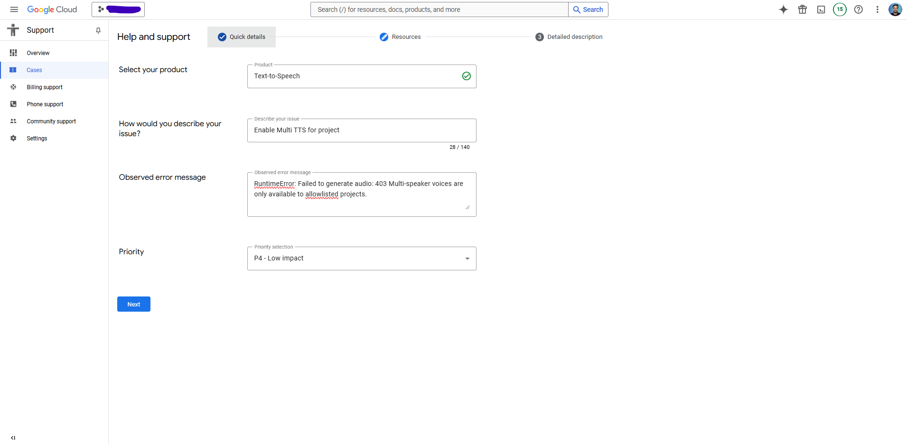

# Podcastfy Configuration

## API keys

The project uses a combination of a `.env` file for managing API keys and sensitive information, and a `config.yaml` file for non-sensitive configuration settings. Follow these steps to set up your configuration:

1. Create a `.env` file in the root directory of the project.
2. Add your API keys and other sensitive information to the `.env` file. For example:

   ```
   GEMINI_API_KEY=your_gemini_api_key_here
   ELEVENLABS_API_KEY=your_elevenlabs_api_key_here
   OPENAI_API_KEY=your_openai_api_key_here
   ```

## API Key Requirements

The API Keys required depend on the model you are using for transcript generation and audio generation.

- Transcript generation (LLMs):

  - By default, Podcastfy uses Google's `gemini-1.5-pro-latest` model. Hence, you need to set `GEMINI_API_KEY`.
  - See how to configure other LLMs [here](how-to.md#custom-llm-support).

- Audio generation (TTS):
  - By default, Podcastfy uses OpenAI TTS. Hence, you need to set `OPENAI_API_KEY`.
  - Additional supported models are ElevenLabs ('elevenlabs'), Microsoft Edge ('edge') and Google TTS ('gemini'). All but Edge require an API key.

> [!Note]
> Never share your `.env` file or commit it to version control. It contains sensitive information that should be kept private. The `config.yaml` file can be shared and version-controlled as it doesn't contain sensitive data.

## Example Configurations

Here's a table showing example configurations:

| Configuration        | Base LLM  | TTS Model              | API Keys Required                 |
| -------------------- | --------- | ---------------------- | --------------------------------- |
| Default              | Gemini    | OpenAI                 | GEMINI_API_KEY and OPENAI_API_KEY |
| No API Keys Required | Local LLM | Edge                   | None                              |
| Recommended          | Gemini    | 'geminimulti' (Google) | GEMINI_API_KEY                    |

In our experience, Google's Multispeaker TTS model ('geminimulti') is the best model in terms of quality followed by ElevenLabs which offers great customization (voice options and multilingual capability). Google's multispeaker TTS model is limited to English only and requires an additional set up step.

## Setting up Google TTS Model

You can use Google's Multispeaker TTS model by setting the `tts_model` parameter to `geminimulti` in `Podcastfy`.

Google's Multispeaker TTS model requires a Google Cloud API key, you can use the same API key you are already using for Gemini or create a new one. After you have secured your API Key there are two additional steps in order to use Google Multispeaker TTS model:

- Step 1: You will need to enable the Cloud Text-to-Speech API on the API key.

  - Go to "https://console.cloud.google.com/apis/dashboard"
  - Select your project (or create one by clicking on project list and then on "new project")
  - Click "+ ENABLE APIS AND SERVICES" at the top of the screen
  - Enter "text-to-speech" into the search box
  - Click on "Cloud Text-to-Speech API" and then on "ENABLE"
  - You should be here: "https://console.cloud.google.com/apis/library/texttospeech.googleapis.com?project=..."

- Step 2: You need to add the Cloud Text-to-Speech API permission to the API KEY you're using on the Google Cloud console.

  - Go to https://console.cloud.google.com/apis/credentials
  - Click on whatever key you're using for Gemini
  - Go down to API Restrictions and add the Cloud Text-to-Speech API

<br>

⚠️**NOTE :**<br>
By default, **Google Multi-Speaker voices** are only available to **allowlisted projects**. If you wish to use these voices, follow the steps below: <br>

- **Request Access:** You'll need to **contact Google Cloud Support** to get Multi-Speaker voices enabled for your project.
- **Common Error:** If Multi-Speaker voices are not enabled, you will encounter the following runtime error:
  ```bash
  RuntimeError: Failed to generate audio: 403 Multi-speaker voices are only available to allowlisted    projects
  ```
- **How to Proceed:**
  - Navigate to the **Support** section in your **GCP Console**. <br>
  - Open a new case under **"Cases"** and provide the necessary project details. <br>
  - Google Cloud Support should be able to assist you in enabling this feature. <br>
    <br>
    
    <br>

Phew!!! That was a lot of steps but you only need to do it once and you might be impressed with the quality of the audio. See [Google TTS](https://cloud.google.com/text-to-speech) for more details. Thank you @mobarski and @evandempsey for the help!

## Conversation Configuration

See [conversation_custom.md](conversation_custom.md) for more details.

## Running Local LLMs

See [local_llm.md](local_llm.md) for more details.

## Optional configuration

The `config.yaml` file in the root directory contains non-sensitive configuration settings. You can modify this file to adjust various parameters such as output directories, text-to-speech settings, and content generation options.

The application will automatically load the environment variables from `.env` and the configuration settings from `config.yaml` when it runs.

See [Configuration](config_custom.md) if you would like to further customize settings.
